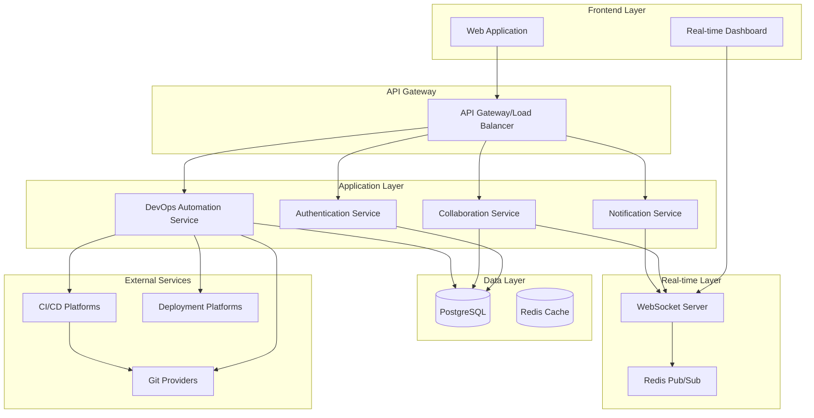

# Ticolops Design Document

## Overview

Ticolops is a real-time collaborative platform that combines project management with automated DevOps workflows. The system provides live visibility into team member activities while automatically handling repository integration, builds, and deployments. The architecture emphasizes real-time communication, scalable DevOps automation, and intuitive user experience.

## Architecture

### High-Level Architecture



**Component Explanations:**
- **GW (API Gateway)**: Routes HTTP requests and handles load balancing
- **WEB**: React-based web application frontend
- **RT**: Real-time dashboard component
- **WS**: WebSocket server for real-time communication
- **AUTH**: Authentication and authorization service
- **COLLAB**: Collaboration and activity tracking service
- **DEVOPS**: DevOps automation and deployment service
- **NOTIFY**: Notification management service

### Technology Stack

**Frontend:**
- React.js with TypeScript for type safety
- Socket.io-client for real-time communication
- Tailwind CSS for responsive design
- React Query for state management and caching

**Backend:**
- FastAPI with Python 3.11+ for high-performance async API
- WebSockets with FastAPI's built-in WebSocket support
- PostgreSQL for persistent data storage
- Redis for caching and pub/sub messaging
- JWT for authentication with python-jose
- SQLAlchemy ORM with async support
- Pydantic for data validation and serialization

**DevOps Integration:**
- GitHub/GitLab API integration
- Docker for containerization
- GitHub Actions/GitLab CI for automated pipelines
- Vercel/Netlify for frontend deployments
- Railway/Render for backend deployments

## Components and Interfaces

### 1. Authentication Service

**Responsibilities:**
- User registration and login
- JWT token management
- Role-based access control
- Integration with university SSO systems

**Key Interfaces:**
```python
from abc import ABC, abstractmethod
from typing import Optional

class AuthService(ABC):
    @abstractmethod
    async def register(self, user_data: UserRegistration) -> AuthResult:
        pass
    
    @abstractmethod
    async def login(self, credentials: LoginCredentials) -> AuthResult:
        pass
    
    @abstractmethod
    async def validate_token(self, token: str) -> User:
        pass
    
    @abstractmethod
    async def refresh_token(self, refresh_token: str) -> AuthResult:
        pass
```

### 2. Collaboration Service

**Responsibilities:**
- Real-time activity tracking
- Team member presence management
- Conflict detection and resolution
- Activity history and analytics

**Key Interfaces:**
```python
class CollaborationService(ABC):
    @abstractmethod
    async def track_activity(self, user_id: str, activity: ActivityData) -> None:
        pass
    
    @abstractmethod
    async def get_team_presence(self, project_id: str) -> list[TeamPresence]:
        pass
    
    @abstractmethod
    async def detect_conflicts(self, project_id: str) -> list[Conflict]:
        pass
    
    @abstractmethod
    async def update_user_status(self, user_id: str, status: UserStatus) -> None:
        pass
```

### 3. DevOps Automation Service

**Responsibilities:**
- Repository integration and webhook management
- Automated build and deployment pipelines
- Environment provisioning
- Deployment status tracking

**Key Interfaces:**
```python
class DevOpsService(ABC):
    @abstractmethod
    async def connect_repository(self, repo_data: RepositoryConnection) -> Integration:
        pass
    
    @abstractmethod
    async def trigger_deployment(self, repo_id: str, branch: str) -> Deployment:
        pass
    
    @abstractmethod
    async def get_deployment_status(self, deployment_id: str) -> DeploymentStatus:
        pass
    
    @abstractmethod
    async def configure_environment(self, project_id: str, config: EnvironmentConfig) -> Environment:
        pass
```

### 4. Notification Service

**Responsibilities:**
- Real-time notification delivery
- Notification preferences management
- Multi-channel notification support (in-app, email, webhook)

**Key Interfaces:**
```python
class NotificationService(ABC):
    @abstractmethod
    async def send_notification(self, notification: NotificationData) -> None:
        pass
    
    @abstractmethod
    async def subscribe_to_events(self, user_id: str, events: list[EventType]) -> None:
        pass
    
    @abstractmethod
    async def update_preferences(self, user_id: str, preferences: NotificationPreferences) -> None:
        pass
```

## Data Models

### Core Entities

```python
from pydantic import BaseModel, Field
from datetime import datetime
from typing import Optional, Literal
from enum import Enum

class UserRole(str, Enum):
    STUDENT = "student"
    COORDINATOR = "coordinator"
    ADMIN = "admin"

class UserStatus(str, Enum):
    ONLINE = "online"
    AWAY = "away"
    OFFLINE = "offline"

class User(BaseModel):
    id: str
    email: str
    name: str
    avatar: Optional[str] = None
    role: UserRole
    status: UserStatus
    last_activity: datetime
    preferences: UserPreferences

class Project(BaseModel):
    id: str
    name: str
    description: str
    owner_id: str
    members: list[ProjectMember]
    repositories: list[Repository]
    created_at: datetime
    updated_at: datetime

class GitProvider(str, Enum):
    GITHUB = "github"
    GITLAB = "gitlab"
    BITBUCKET = "bitbucket"

class Repository(BaseModel):
    id: str
    project_id: str
    name: str
    url: str
    provider: GitProvider
    branch: str
    webhook_id: Optional[str] = None
    deployment_config: DeploymentConfig
    last_deployment: Optional[Deployment] = None

class ActivityType(str, Enum):
    CODING = "coding"
    REVIEWING = "reviewing"
    TESTING = "testing"
    DOCUMENTING = "documenting"

class Activity(BaseModel):
    id: str
    user_id: str
    project_id: str
    type: ActivityType
    location: str  # file path or component name
    timestamp: datetime
    metadata: dict[str, any] = Field(default_factory=dict)

class DeploymentStatus(str, Enum):
    PENDING = "pending"
    BUILDING = "building"
    SUCCESS = "success"
    FAILED = "failed"

class Deployment(BaseModel):
    id: str
    repository_id: str
    branch: str
    commit_hash: str
    status: DeploymentStatus
    url: Optional[str] = None
    logs: list[str] = Field(default_factory=list)
    started_at: datetime
    completed_at: Optional[datetime] = None
```

## Error Handling

### Error Categories

1. **Authentication Errors**
   - Invalid credentials
   - Expired tokens
   - Insufficient permissions

2. **Integration Errors**
   - Repository connection failures
   - Webhook configuration issues
   - API rate limiting

3. **Deployment Errors**
   - Build failures
   - Environment provisioning issues
   - Network connectivity problems

4. **Real-time Communication Errors**
   - WebSocket connection drops
   - Message delivery failures
   - Synchronization conflicts

### Error Handling Strategy

```python
from fastapi import HTTPException, Request
from fastapi.responses import JSONResponse
from datetime import datetime
import logging

class ErrorResponse(BaseModel):
    code: str
    message: str
    details: Optional[dict[str, any]] = None
    timestamp: datetime
    request_id: str

# Global exception handler
async def global_exception_handler(request: Request, exc: Exception) -> JSONResponse:
    error_response = ErrorResponse(
        code=exc.__class__.__name__ or "INTERNAL_ERROR",
        message=str(exc),
        timestamp=datetime.utcnow(),
        request_id=request.headers.get("x-request-id", "unknown")
    )
    
    # Log error for monitoring
    logging.error(f"Error: {error_response.dict()}")
    
    # Determine status code based on exception type
    status_code = getattr(exc, 'status_code', 500)
    
    return JSONResponse(
        status_code=status_code,
        content=error_response.dict()
    )
```

## Testing Strategy

### Unit Testing
- pytest for Python testing framework
- pytest-asyncio for async test support
- httpx for API endpoint testing
- pytest-mock for mocking external services (Git providers, deployment platforms)
- React Testing Library for frontend component testing

### Integration Testing
- Test database interactions with test containers
- Test WebSocket connections and real-time features
- Test webhook handling and external API integrations
- End-to-end repository connection workflows

### End-to-End Testing
- Playwright for browser automation
- Test complete user workflows (registration → project creation → repository connection → deployment)
- Test real-time collaboration scenarios with multiple users
- Test deployment pipeline from code push to live preview

### Performance Testing
- Load testing for WebSocket connections
- Database query optimization testing
- API response time monitoring
- Deployment pipeline performance benchmarks

### Security Testing
- Authentication and authorization testing
- Input validation and sanitization
- Rate limiting effectiveness
- Webhook signature verification
- Token security and rotation

## Real-time Communication Design

### WebSocket Event Structure

```python
from enum import Enum
from pydantic import BaseModel
from datetime import datetime
from typing import Optional, Any

class EventType(str, Enum):
    USER_ACTIVITY = "user_activity"
    DEPLOYMENT_STATUS = "deployment_status"
    TEAM_PRESENCE = "team_presence"
    NOTIFICATION = "notification"
    CONFLICT_DETECTED = "conflict_detected"

class WebSocketEvent(BaseModel):
    type: EventType
    payload: Any
    timestamp: datetime
    user_id: Optional[str] = None
    project_id: Optional[str] = None
```

### Presence Management

The system maintains real-time presence information using a combination of WebSocket heartbeats and activity tracking:

1. **Heartbeat System**: Clients send periodic heartbeat messages every 30 seconds
2. **Activity Tracking**: User actions automatically update presence status
3. **Idle Detection**: Users marked as "away" after 5 minutes of inactivity
4. **Graceful Disconnection**: Proper cleanup when users close the application

### Conflict Detection Algorithm

```python
from datetime import datetime, timedelta
from collections import defaultdict

async def detect_conflicts(activities: list[Activity]) -> list[Conflict]:
    conflicts: list[Conflict] = []
    location_map: dict[str, list[Activity]] = defaultdict(list)
    
    # Group activities by location (file/component)
    for activity in activities:
        key = f"{activity.project_id}:{activity.location}"
        location_map[key].append(activity)
    
    # Detect overlapping work
    for location, location_activities in location_map.items():
        if len(location_activities) > 1:
            # Filter to recent activities (last 5 minutes)
            five_minutes_ago = datetime.utcnow() - timedelta(minutes=5)
            recent_activities = [
                a for a in location_activities 
                if a.timestamp > five_minutes_ago
            ]
            
            if len(recent_activities) > 1:
                conflicts.append(Conflict(
                    type="concurrent_work",
                    location=location.split(":")[1],
                    users=[a.user_id for a in recent_activities],
                    severity="medium"
                ))
    
    return conflicts
```